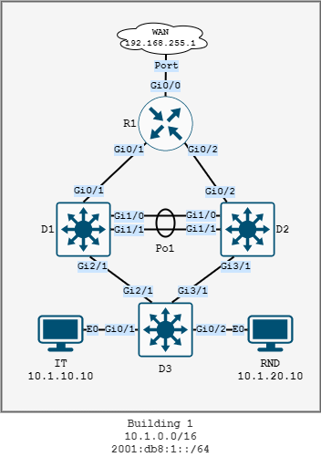

# ENCOR - University lab

This is a lab that builds a network in different phases. As an example we are using a imaginary university network. Some of the skills needed are (but not excluded to):

- spanning tree + security
- etherchannel
- vlans
- fhrp protocols
- static routing
- ospf
- bgp
- ipv6
- ntp
- syslog
- ipsec
- vrf
- nat
- ...

> **BEWARE:** This design does not follow best practices. Shortcuts were taken (and other crappy solutions) in order to stay under the 20 node limit in cml.

The lab follows an organic approach where you are tasked bit by bit to expand the existing network.

## How to use this repo

The cml lab can be found in the `cml` directory. The lab is fully built and includes (basic) default configurations for all devices. There is also a fully built and configured lab provided.

All drawings and other assets can be found in the `assets` directory. 

## Network design overview

The network uses the following supernet and considerations:

- For IPv4 `10.0.0.0/8` is used as the supernet as `10.building.vlan.ip` 
- For IPv6 `2001:db8::/64` is used as the supernet as `2001:db8:building:vlan::ip` 
- The network has been assigned `AS65200`
- Gateways are always the first usable ip in each range
- Vlan `30` is used for switch management
- Subnet `40` is used on each site for router management

# Phase 1



The university has tasked you to deploy the network for building `1`. You will need to provide the following vlans. Cable all devices according to the diagram.

```
IT vlan 10 - 10.1.10.0/24
RND vlan 20 - 10.1.20.0/24
MGMT vlan 30 - 10.1.30.0/24
NATIVE vlan 999
```

Setup the vlan trunks and access ports on and between all devices:

- Switches D1 and D2 are connected via etherchannel using the `LACP` protocol. 
- Disable `DTP` and use `dot1q` encapsulation. 
- Force the ports into `trunk` mode. 
- Allow only the necessary vlans.
- Configure access ports on D3 for the IT and RND pc.

Setup spanning tree:

- Use `rapid-pvst` as the spanning-tree protocol.
- D1 is the root bridge for all client vlans (10,20) and D2 is the secondary root bridge
- Use root guard on all necessary ports on D1
- Use portfast for all edge ports and enable bpduguard on D3

Set a login banner on all devices containing `Unauthorized access prohibited`.

Setup management interfaces on all switches in the mgmt vlan (30). Use the following ip addresses:

```
D1 - 10.1.30.21
D2 - 10.1.30.22
D3 - 10.1.30.23
```

Setup management for R1. Use interface `Lo40` with ip address `10.1.40.10`.

Allow management via ssh version 2 on all devices:

- use the domain name `uni.local` 
- username `uni` password `admin`
- `2048 bit` keys. 
- Use a standard acl to only allow the `10.1.10.0/24` IT subnet access to the switches via ssh. Name the acl `MGMT_IT`.

Provide a redundant gateway for the IT and RND vlan on D1 and D2. Use `HSRP` version 2 with the following parameters:

- hello and hold timer of 1 and 3 seconds
- authentication plaintext string `fail0ver`
- the hsrp group number equals the vlan id
- D1 has the `10.1.x.251` ip and D2 has the `10.1.x.252` ip for each vlan
- The gateway is `10.1.x.1`
- Enable preemption with a delay of `30` seconds
- D1 has a priority of `150` and D2 has a priority of `130`

Track the line protocol for interface `g0/1` on D1. If the protocol goes down decrement the hsrp priority with `40`. Use tracking group `5`.Setup routed ports between R1 and D1/D2. Use the following ip addresses:

```
D1 - G0/1 - 10.1.11.2/30
D2 - G0/2 - 10.1.11.6/30
R1 - G0/1 - 10.1.11.1/30
R1 - G0/2 - 10.1.11.5/30
```

Setup fully specified, static routes:

- For D1 and D2 pointing to R1, setup a default route
- On R1 setup fully specified default static routes to D1 and D2 for the `10.1.0.0/8` network. Give the route to D1 a metric of `1` and the route to D2 a metric of `2`.

Connect R1 to the WAN:

- Use `192.168.255.2/24` as the ip address on interface `G0/0`. 
- Setup a fully specified default static route pointing to the WAN with a metric of 150.
- Setup PAT for the `10.1.0.0/16` network. 
- Don't allow RND access to the internet. Name the acl `PAT_10_1_0_0`.

# Phase 2

Phase 2 sees the rollout of basic services.

Let R1 use `9.9.9.9` and `8.8.8.8` as domain servers.

Setup ntp: 

- On R1 setup ntp to sync to `pool.ntp.org` . 
- Setup R1 as a ntp master for the network with a stratum value of `4`.
- Setup ntp on D1, D2 and D3 to use R1 (`10.1.40.10`) as their ntp server.

implement syslog:

- Send all logs to `10.1.10.20`. 
- Use the management interface of each device as the source ip
- Send all logs that are `warning` and above.

Setup snmp::

- Use the community string `unimon` and provide `read-only` access
- Only allow the IT vlan to use the `unimon` community. Use the `MGMT_IT` for this purpose
- Set the contact to `it@uni.local` and the location to `Building 1`
- Set the source interface to the `management interface` for snmp traps
- Set the host to receive trap interfaces to `10.1.10.20` with a version `2c` community string of `unitrap`
- On all switches enable traps for `hsrp`, `spanning-tree` and `ip sla`
- On all routers enable traps for `config`, `ospf`, `bgp` and `ip sla`

# Phase 3

Management has requested to roll out IPv6 for building 1

The following IPv6 networks are used:

```
IT vlan 10 - 2001:db8:1:10::/64
ROUTING vlan 11 - 2001:db8:1:11::/64
RND vlan 20 - 2001:db8:1:20::/64
MGMT vlan 30 - 2001:db8:1:30::/64
```

Setup management interfaces on all switches in the mgmt vlan (30). Use the following ip addresses:

```
D1 - 2001:db8:1:30::21/64
D2 - 2001:db8:1:30::22/64
D3 - 2001:db8:1:30::23/64
```

Setup management for R1. Use interface `Lo40` with ip address `2001:db8:1:40::10/64`.

Enable IPv6 unicast routing on D1, D2 and R1

Use a standard IPv6 acl to only allow the `2001:db8:1:30::/64` IT subnet access to the switches via ssh. Name the acl `MGMT_IT_V6`.

Provide a redundant gateway for the IT and RND vlan on D1 and D2. Use `HSRP` version 2 with the following parameters:

- hello and hold timer of 1 and 3 seconds
- authentication plaintext string `fail0ver`
- the hsrp group number equals `1000 + vlan id`. The group number of vlan 20 would be `1020`
- D1 has the `2001:db8:1:x::251/64` ip and D2 has the `2001:db8:1:x::251/64` ip for each vlan
- For the IPv6 address use  `autoconfig`
- Enable preemption with a delay of `30` seconds
- D1 has a priority of `150` and D2 has a priority of `130`

Track the line protocol for interface `g0/1` on D1. If the protocol goes down decrement the hsrp priority with `40`. Use tracking group `5`.

Setup routed ports between R1 and D1/D2. Use the following ip addresses:

```
D1 - G0/1 - 2001:db8:1:11::2/126
D2 - G0/2 - 2001:db8:1:11::6/126
R1 - G0/1 - 2001:db8:1:11::1/126
R1 - G0/2 - 2001:db8:1:11::5/126
```

Setup fully specified, static routes:

- For D1 and D2 pointing to R1, setup a default route
- On R1 setup fully specified default static routes to D1 and D2 for the `2001:db8:1::/48` network. Give the route to D1 a metric of `1` and the route to D2 a metric of `2`.

# Phase 4

Another building is built with IPv4 subnet `10.2.0.0` and IPv6 subnet `2001:db8:2::/48`. 

Configure all devices in building 2:

- Setup ipv6 routing
- Setup a `lo40` on R2 with the ip address `10.2.40.10` and ipv6 address `2001:db8:2:40::10/64`
- Setup management interfaces on all switches in vlan 30
  - D4 with the ip address `10.2.30.20` and ipv6 address `2001:db8:2:30::20/64`
  - D5 with the ip address `10.2.30.21` and ipv6 address `2001:db8:2:30::21/64`

- Setup SSH access on all devices
  - use the domain name `uni.local` 
  - username `uni` password `admin`
  - `2048 bit` keys. 
  - Use a standard acl to only allow the `10.1.10.0/24` IT subnet access to the switches via ssh. Name the acl `MGMT_IT`.

Provide connectivity between R1 and R2:

```
R1 - G0/3 - 203.0.113.1/30
R1 - G0/3 - 2001:db8:203:113::1/126
R1 - G0/3 - FE80::1
R2 - G0/3 - 203.0.113.2/30
R2 - G0/3 - 2001:db8:203:113::2/126
R2 - G0/3 - FE80::2
```


Use OSPF as a dynamic routing protocol:

- Use `ospfv3` with process id `10`
- The router id is `10.x.0.y` where `x` is the building and `y` is the router number.
  - R2 would have `10.2.0.2` as RID

- Set the reference bandwidth to `10Gbps`
- Set all interfaces to be passive interfaces by default
- Use area 0 between routers and use the area id with the building number for all interfaces pointing to a building
- Using address families
  - Summarize the networks for both address families on R1 and R2

- Allow R1 to propagate it's default route
- Configure interface G0/3 on both routers as a `point-to-point` interface

Ospf routing and summarization. The building contains 2 lab environments with overlapping subnets. provide a vrf for each lab environment and provide PAT for each lab network

vrf definition with address families lab_production lab_development

vrf forwarding

pat for both vrfs

# Phase 5

2 bgp routers on the network edge. use route maps to prefer one inbound path via as_path prepending and make sure that our network does not become a transit network

# Phase 6

A remote office was added. Use one router with a loopback and ipsec. aaa rolout for the network

use vrrp somewhere

create span vlan

send netflow to a collector

# Phase 7

Management has tasked you with a compliancy project. Use automation to achieve the following:

- Implement the banner `Unauthorized access prohibited` on all devices
- Setup ntp: 

  - Setup R1 and R2 as ntp peers
  - Setup all devices in building 1 to use R1 (`10.1.40.10`) as their ntp server and use R2 as backup
  - Setup all devices in building 2 to use R2 (`10.2.40.10`) as their ntp server and user R1 as backup

- Implement syslog:
  - Send all logs to `10.1.10.20`. 
  - Use the management interface of each device as the source ip
  - Send all logs that are `warning` and above.

- Setup snmp::
  - Use the community string `unimon` and provide `read-only` access
  - Only allow the IT vlan to use the `unimon` community. Use the `MGMT_IT` for this purpose
  - Set the contact to `it@uni.local` and the location to `Building x` where x is the building number
  - Set the source interface to the `management interface` for snmp traps
  - Set the host to receive trap interfaces to `10.1.10.20` with a version `2c` community string of `unitrap`
  - On all switches enable traps for `hsrp`, `spanning-tree` and `ip sla`
  - On all routers enable traps for `config`, `ospf`, `bgp` and `ip sla`
- Security
  - Use a standard acl to only allow the `10.1.10.0/24` IT subnet access to the devices via ssh. Name the acl `MGMT_IT`.
  - Use a standard IPv6 acl to only allow the `2001:db8:1:30::/64` IT subnet access to the management interface via ssh. Name the acl `MGMT_IT_V6`.


# Startup configurations

## Endpoints

### IT

```
# this is a shell script which will be sourced at boot
hostname IT
ip link set dev eth0 up
ip address add 10.1.10.10/24 dev eth0
ip route add default via 10.1.10.1
ip -6 address add 2001:db8:1:10::10/64 dev eth0
echo 'nameserver 9.9.9.9' > /etc/resolv.conf
# configurable user account
USERNAME=cisco
PASSWORD=cisco
```

### RND

```
# this is a shell script which will be sourced at boot
hostname RND
ip address add 10.1.20.10/24 dev eth0
ip link set dev eth0 up
ip route add default via 10.1.20.1
ip -6 address add 2001:db8:1:20::10/64 dev eth0
echo 'nameserver 9.9.9.9' > /etc/resolv.conf
# configurable user account
USERNAME=cisco
PASSWORD=cisco
```

## Routers

### R1

```
hostname R1
no logging console

line con 0
 exec-timeout 0 0
 logging synchronous
line vty 0 4
 exec-timeout 0 0
 logging synchronous
line vty 5 15
 exec-timeout 0 0
 logging synchronous
end
```

### R2

```
hostname R2
no logging console

line con 0
 exec-timeout 0 0
 logging synchronous
line vty 0 4
 exec-timeout 0 0
 logging synchronous
line vty 5 15
 exec-timeout 0 0
 logging synchronous
end
```

## Switches

### D1

```
hostname D1
no logging console

line con 0
 exec-timeout 0 0
 logging synchronous
line vty 0 4
 exec-timeout 0 0
 logging synchronous
line vty 5 15
 exec-timeout 0 0
 logging synchronous
end
```

### D2

```
hostname D2
no logging console

line con 0
 exec-timeout 0 0
 logging synchronous
line vty 0 4
 exec-timeout 0 0
 logging synchronous
line vty 5 15
 exec-timeout 0 0
 logging synchronous
end
```

### D3

```
hostname D3
no logging console

line con 0
 exec-timeout 0 0
 logging synchronous
line vty 0 4
 exec-timeout 0 0
 logging synchronous
line vty 5 15
 exec-timeout 0 0
 logging synchronous
end
```

### D4

```
hostname D4
no logging console

line con 0
 exec-timeout 0 0
 logging synchronous
line vty 0 4
 exec-timeout 0 0
 logging synchronous
line vty 5 15
 exec-timeout 0 0
 logging synchronous
end
```

### D5

```
hostname D5
no logging console

line con 0
 exec-timeout 0 0
 logging synchronous
line vty 0 4
 exec-timeout 0 0
 logging synchronous
line vty 5 15
 exec-timeout 0 0
 logging synchronous
end
```